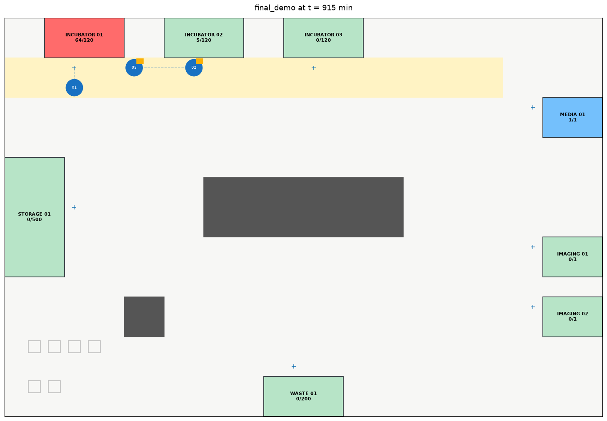
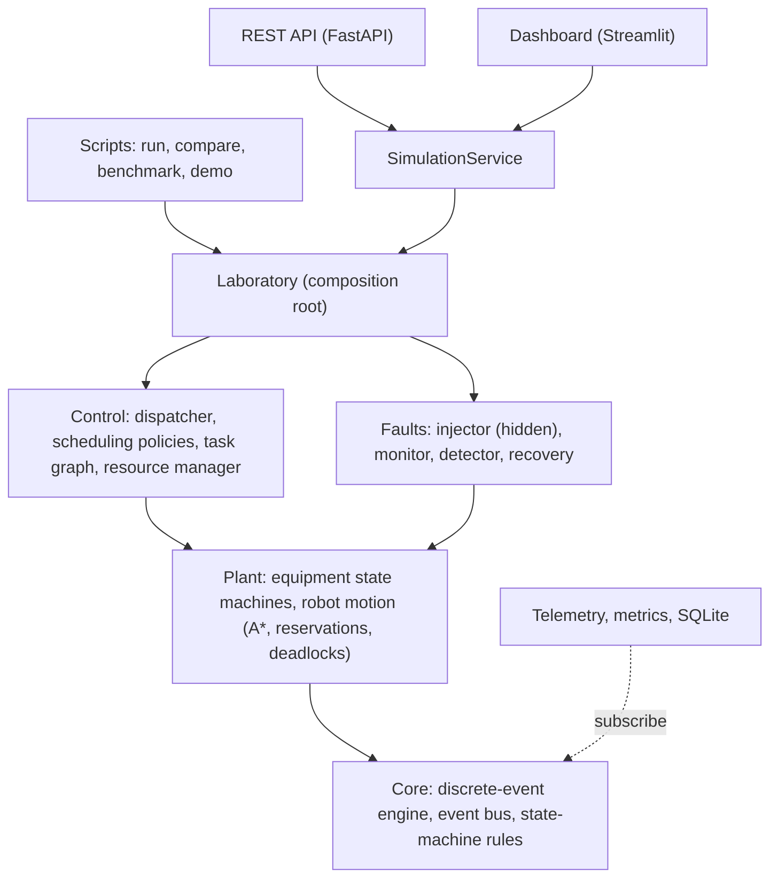
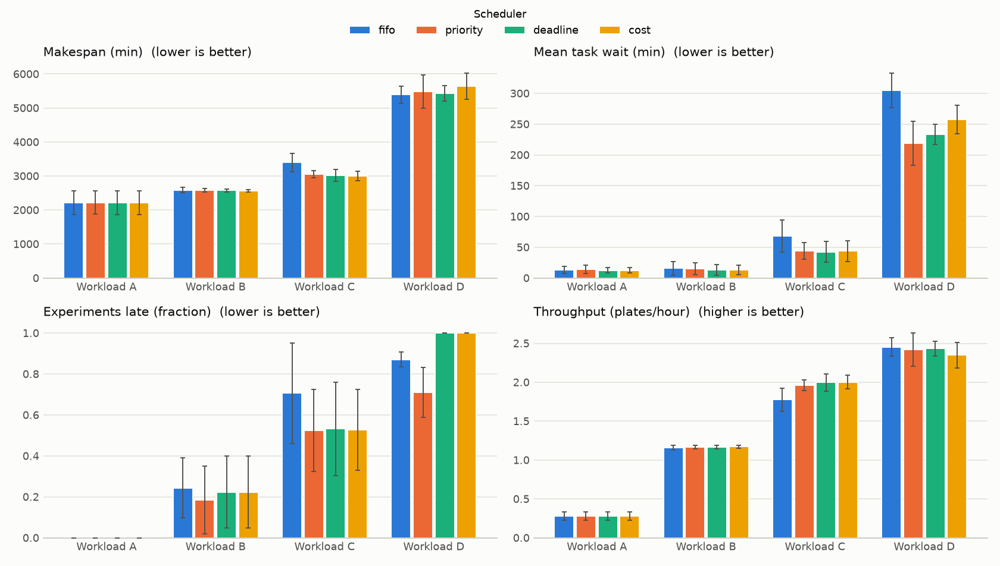

# BioFlow-X

**A fault-tolerant digital twin and supervisory control platform for a simulated cell-culture laboratory.**

BioFlow-X simulates an automated cell-culture lab and the software that runs it. The lab has transport
robots, incubators, media-exchange and imaging stations, and storage. The software:

- turns experiment protocols into dependency graphs of tasks;
- schedules them with interchangeable policies;
- moves plates with robots that plan paths with A\* and coordinate so they never collide;
- detects equipment failures from symptoms alone and recovers from them automatically.

A discrete-event engine runs it all deterministically and much faster than real time. A REST API and a
Streamlit dashboard let you watch and control the lab while it runs.

It is an original, fully software-based engineering project: no physical equipment or biological
samples are involved. The biology is reduced to workflow constraints (temperature, CO2, incubation
times, deadlines); nothing models cell growth.


*The 2D twin during the final demo: INCUBATOR_01 (red) has lost climate control, and robots are moving
its plates to INCUBATOR_02. Drawn by the dashboard's own code from live simulation state.*

## The problem

A lab running many experiments at once shares a few robots and stations between them. Every
experiment is a protocol of timed, dependent steps with a deadline. The control system has to decide
what runs next, move plates without robot collisions or deadlocks, and keep going when equipment
fails, often in the middle of a step, without losing track of any plate. BioFlow-X builds that
control layer and a simulated lab to test it against, so scheduling, coordination and fault tolerance
can be designed, measured and compared.

## Features

| Area | What it does |
|---|---|
| **Simulation core** | Priority-queue discrete-event engine; seeded and deterministic; causal FIFO event bus |
| **Domain & state machines** | Plates, experiments, protocols and tasks with declarative, validated transition tables; every equipment state change goes through one checked choke point |
| **Protocols** | YAML protocols validated with located, "did you mean" errors; synchronised steps create join points in the task graph |
| **Scheduling** | FIFO, priority, earliest-deadline-first, and a weighted cost-based policy that explains each decision; weights tuned by random search with a held-out test set |
| **Robotics** | Grid floor plan, A\* (checked against Dijkstra), cell reservations (collision-free by construction), wait-for-graph deadlock detection with escalating resolution, parking and nudging |
| **Faults** | 10 injectable fault types with hidden physical effects; detection from heartbeats, sensor readings and timings only; consequential-alarm suppression; automatic recovery with safe holds and quarantine |
| **Observability** | Structured telemetry (JSON Lines), time-weighted metrics, SQLite persistence |
| **Interfaces** | FastAPI REST API (17 endpoints); Streamlit dashboard (8 pages, live 2D twin) |
| **Analysis** | Seeded workload generator, paired multi-seed benchmarks, weight tuning, an optional IsolationForest anomaly detector, scale testing to 5,000 plates |

## Architecture



- **Layers:** dependencies point one way only, and components talk through events, so observers
  (telemetry, metrics, the detector) are never known to the parts they watch.
- **One owner per fact:** equipment owns occupancy, the resource manager owns reservations, and
  entities own their own state.
- **Hidden faults:** the fault injector's ground truth goes to a channel the detector is tested
  never to read.

More in [docs/architecture.md](docs/architecture.md) and the
[engineering report](docs/engineering_report.md).

## Technology

Python 3.11+ · PyYAML · FastAPI + Uvicorn · SQLite (standard library) · Streamlit · matplotlib ·
pandas · scikit-learn (optional anomaly detector only) · pytest, pytest-cov, ruff.
The engine, scheduling, path planning and fault logic use only the Python standard library.

## Installation (Windows, PowerShell)

```powershell
git clone https://github.com/xnushree/BioFlow.git
cd BioFlow
python -m venv .venv
.\.venv\Scripts\Activate.ps1
pip install -r requirements-dev.txt
pip install -e .
```

(On Linux/macOS, activate with `source .venv/bin/activate`; everything else is the same.)

## Running it

```powershell
# Simulator: run a scenario and print its summary
python simulation/run_simulation.py simulation/scenarios/basic_demo.yaml
python simulation/run_simulation.py simulation/scenarios/multiple_failures.yaml --scheduler cost

# The same scenario under every scheduler
python simulation/compare_schedulers.py simulation/scenarios/basic_demo.yaml

# The scripted final demonstration (load, run, fail, detect, recover, compare)
python simulation/final_demo.py

# REST API (interactive docs at http://127.0.0.1:8000/docs)
uvicorn bioflow.api.main:app

# Dashboard
streamlit run dashboard/app.py

# Tests, coverage and lint
pytest -q
pytest --cov=bioflow --cov-report=term-missing
ruff check .

# Analysis (minutes each)
python simulation/benchmark.py          # 80 runs -> results/reports/benchmark_report.md + charts
python simulation/tune_cost_weights.py  # random search with train/test seeds
python simulation/anomaly_detection.py  # IsolationForest on simulated telemetry
python simulation/scale_test.py         # 100 .. 5,000 plates
```

## Example scenario

A scenario is YAML: equipment, floor plan, experiments and (optionally) faults.

```yaml
scenario: final_demo
seed: 2026
scheduler: fifo
equipment_config: configs/equipment.yaml
equipment_overrides: {robots: {count: 3}, incubators: {count: 3}, imaging_stations: {count: 2}}
laboratory_config: configs/laboratory.yaml
experiments:
  - {id: EXP_A, protocol: basic_experiment,   plates: 24, priority: 1, submit_at_min: 0,  deadline_min: 2760}
  - {id: EXP_B, protocol: imaging_experiment, plates: 12, priority: 3, submit_at_min: 30, deadline_min: 1560}
  # ...
faults:
  - {type: ROBOT_FAILURE,     equipment: ROBOT_02,     at_min: 35,  duration_min: 60}
  - {type: INCUBATOR_FAILURE, equipment: INCUBATOR_01, at_min: 900, duration_min: 240, severity: CRITICAL}
```

## Fault-injection demonstration

`python simulation/final_demo.py` runs 72 plates in four experiments. A robot controller crashes while
the robot is moving, and later an incubator loses climate control. Output (abridged):

```
* INJECTED ROBOT_FAILURE on ROBOT_02 at t=35.0 (repaired t=95.0)
    DETECTED  t=38.0 (+3.0 min) as ROBOT_FAILURE: no heartbeat for 4.0 min and no progress on its job
    RECOVERY  robot taken out of service
    RECOVERY  job handed to another robot
    RECOVERY  back in service
* INJECTED INCUBATOR_FAILURE on INCUBATOR_01 at t=900.0 (repaired t=1140.0)
    DETECTED  t=909.0 (+9.0 min) as INCUBATOR_FAILURE: temperature and CO2 both out of tolerance
              (temperature 34.92 degC, CO2 4.30 %): climate control lost
    RECOVERY  incubator taken out of service
    RECOVERY  71 exposed plates marked SUSPECTED
    RECOVERY  back in service
False alarms: 0          Tasks completed: 408/408
```

The demo then re-runs the identical workload under every policy, and once without faults:

| Run | Makespan (min) | Late experiments | Total lateness (min) | Mean task wait (min) | Plates exposed to failures | Tasks rescheduled |
|---|---:|---:|---:|---:|---:|---:|
| fifo | 3140.8 | 3 | 416.3 | 60.7 | 71 | 24 |
| priority | 3147.1 | 3 | 532.5 | 60.7 | 71 | 24 |
| deadline | 3145.4 | 3 | 406.8 | 60.6 | 71 | 24 |
| cost | 3129.6 | 3 | 380.0 | 59.0 | 39 | 1 |
| fifo, no faults | 3131.0 | 3 | 379.8 | 59.0 | 0 | 0 |

The faults cost this workload only about 10 minutes of makespan, because recovery absorbed them. The
three late experiments are late even without faults: the lab's single media station is the
bottleneck. The most visible difference between policies is *exposure*. The fixed-rule policies send
every plate to the first free incubator, which concentrates all 71 plates in one unit. The cost
policy spreads them out, so the same failure touched 39. This is one scenario with one seed; the
benchmark below is the fair comparison.

## Benchmark results

80 runs: 4 workloads × 4 schedulers × 5 seeds, paired (every scheduler sees identical generated
scenarios). Full method and caveats: [docs/benchmarking.md](docs/benchmarking.md).



- **Integrity:** 50,216/50,216 tasks completed, 0 stalled runs, 176/180 injected faults detected, 0
  false alarms. The 4 misses are one imager fault that occurred while the imager was never used.
- **Light load:** no meaningful difference between policies.
- **Tight deadlines with failures:** every non-FIFO policy beat FIFO. Late experiments fell from 71 %
  to 52-53 %, and mean task wait from 68 to 42-44 min.
- **Overload:** there are trade-offs and no winner. EDF has the lowest lateness but is late on every
  experiment (the "domino effect"), while priority scheduling gets the most experiments in on time.
- **Tuning:** on held-out seeds the objective went from 0.641 (FIFO) to 0.422 (hand-set weights) to
  0.333 (tuned weights).
- **Scale:** wall time grows linearly. 5,000 plates (2.2 M events, 140 simulated days) run in 59 s at
  about 37,000 events/s; see [docs/performance.md](docs/performance.md).

## Testing

778 automated tests (unit, integration and system), 97 % line coverage, and a clean `ruff` lint. The
suite includes:

- exhaustive legal/illegal state-transition checks;
- randomised task-graph execution orders;
- A\* checked against Dijkstra on random maps;
- detector isolation from ground truth;
- API tests through FastAPI's TestClient;
- headless dashboard tests with Streamlit AppTest;
- regression tests for every bug the benchmarks and scale tests found.

## Project structure

```
src/bioflow/
  core/          clock, event engine, event bus, exceptions, state-machine rules
  domain/        plates, experiments, protocols, tasks
  equipment/     robot, incubator, stations, storage, waste; equipment config
  robotics/      floor plan, A*, multi-robot motion and deadlock handling
  protocols/     YAML protocol loading and validation
  scheduling/    task graph and the four policies
  control/       dispatcher, resource manager, state manager
  faults/        injector, monitor, detector, recovery, diagnostics
  telemetry/     logging, event recorder, metrics
  database/      SQLite schema and repository
  analytics/     summaries, benchmarking, tuning, plots, anomaly detection
  api/           FastAPI app and routes
  laboratory.py  composition root;  scenario.py  scenario files;  service.py  live-simulation service
configs/         equipment, floor plan, scheduling weights, fault settings, benchmark workloads
protocols/       experiment protocols
simulation/      runners, benchmark/tuning/scale/demo scripts, scenario files
dashboard/       Streamlit app
docs/            design documents and the engineering report
results/         benchmark data, charts and reports
tests/           unit, integration and system tests
```

## Limitations and future work

**Limitations**

- This is a simulation with simple timing and state models. It has no physics, no real device
  protocols and no hardware.
- The workloads are synthetic, the samples are small (5 seeds), and the fault models are idealised
  (for example, a noise-free robot drive).
- The policies are online dispatch rules, not optimal planners.
- It runs one simulation at a time, is single-user, and is not built for deployment.

**Future work:** see the [engineering report](docs/engineering_report.md#19-future-improvements). The
main items are:

- a constraint-programming baseline scheduler;
- noisier sensor and drive models;
- a SiLA 2 / OPC UA-shaped device layer;
- parallel benchmarks.

## Author

**Anushree Verma** ([@xnushree](https://github.com/xnushree)), IIT Mandi.

## Acknowledgements

Developed with **Claude (Anthropic)** as an AI pair-programmer and mentor. Claude helped plan the
phased architecture, write and review code and tests, and investigate the bugs described in the docs.
Design decisions, verification of results and responsibility for the project are the author's.
