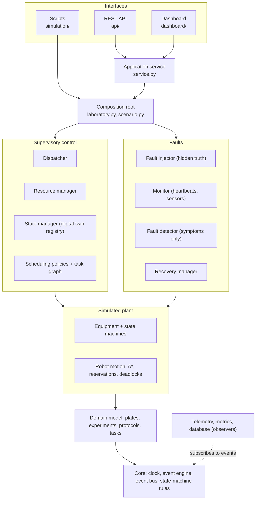

# Architecture

BioFlow-X is a supervisory control system running against a simulated plant. The *plant* is a virtual
cell-culture lab (robots, incubators, media and imaging stations, storage). The *controller* turns
experiment protocols into tasks, schedules them, moves plates with robots, and detects and recovers from
faults. Everything runs in simulated time on a discrete-event engine.

## Layers

Dependencies point one way only: a module may import from layers below it, never above. That rule
alone rules out circular imports, and it is why, for example, the state-machine machinery lives in
`core` (equipment and domain objects need it) rather than in `control`.



| Layer | Packages | Responsibility |
|---|---|---|
| Core | `core/` | Simulation clock, priority-queue event engine, publish/subscribe bus, exception hierarchy, state-machine rules |
| Domain | `domain/` | Plain, validated data: plates, experiments, protocols, tasks, culture conditions |
| Plant | `equipment/`, `robotics/` | Equipment behaviour and state machines; robot motion, A* planning, cell reservations, deadlock handling |
| Control | `control/`, `scheduling/`, `protocols/` | Protocol parsing, task graph, scheduling policies, dispatching, resource reservation, the twin registry |
| Faults | `faults/` | Fault injection (ground truth), monitoring, symptom-based detection, automatic recovery |
| Observers | `telemetry/`, `analytics/`, `database/` | Structured event records, metrics, benchmarking, anomaly detection, SQLite persistence |
| Interfaces | `service.py`, `api/`, `dashboard/`, `simulation/` | Live-simulation service, REST API, Streamlit dashboard, command-line runners |

## How the pieces talk: events

Components communicate through the event bus instead of calling each other. A robot does not know
who asked it to move: it publishes `TRANSPORT_COMPLETED`, and the dispatcher, resource manager, fault
detector, metrics collector and telemetry each react independently.

There are two kinds of event, and they are kept distinct:

- **Scheduled events** sit in the engine's priority queue and happen in the future ("robot 2 finishes
  this step at t = 152.4"). They are what moves simulated time forward.
- **Notifications** are published on the bus the moment something happens ("plate picked"). The bus
  delivers them in causal (FIFO) order, so every subscriber sees events in the order they were
  published. Observer subscriptions (telemetry, metrics, dashboard) are *non-critical*: if one of them
  fails, the error is isolated and counted and control logic carries on.

## Single source of truth

Each fact is stored in exactly one place:

- Each entity owns its own state (`plate.state`, `robot.state`); the state manager only knows *which*
  entities exist.
- Equipment owns *occupancy* (which plates are inside it); the resource manager owns only
  *reservations* (which plates are on their way). Free capacity = capacity - occupancy - reservations.
- A plate's priority and deadline belong to its experiment and are not copied onto the plate.
- The fault injector's ground truth is published on a separate channel that the detector never
  subscribes to (a test enforces this). The dashboard shows it separately, labelled as ground truth.

## A task's life

```mermaid
sequenceDiagram
    participant G as Task graph
    participant D as Dispatcher
    participant S as Scheduling policy
    participant R as Resource manager
    participant B as Robot
    participant E as Station / incubator
    G->>D: task becomes READY
    D->>S: order ready tasks; choose destination and robot
    D->>R: reserve destination
    D->>B: start transport
    B-->>D: PLATE_PLACED (bus)
    D->>E: start processing
    E-->>D: PROCESSING_COMPLETED (bus)
    D->>G: mark completed (dependents become READY)
```

## Key design decisions

| Decision | Why |
|---|---|
| Discrete-event simulation, never `sleep` | Runs far faster than real time and is deterministic for a given seed |
| State machines as declarative transition tables | Illegal moves are impossible, tables are checked at import, and tests cover every legal and illegal pair |
| Scheduler = policy only; dispatcher = execution | Policies are interchangeable, and comparisons between them are fair |
| Reserve a destination before moving | A robot can never arrive at a full station |
| Cell reservations for robots | Collisions are impossible by construction; deadlocks are detected on the wait-for graph and resolved |
| Faults detected from symptoms only | Detection has to be earned from heartbeats, readings and timings, not read from a flag |
| Configuration in YAML with validation | Every parameter is changeable without code edits, and typos fail loudly with "did you mean" hints |
| Composition root (`Laboratory`) | Only one place wires components together; everything else is constructed with its collaborators and testable alone |

See also: [simulation.md](simulation.md), [scheduling.md](scheduling.md),
[fault-recovery.md](fault-recovery.md), [api.md](api.md), [benchmarking.md](benchmarking.md),
[anomaly_detection.md](anomaly_detection.md), [performance.md](performance.md).
