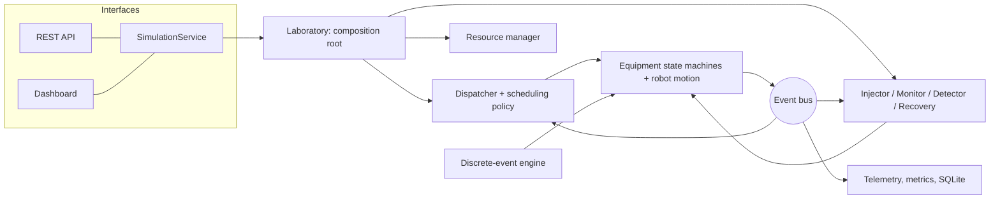
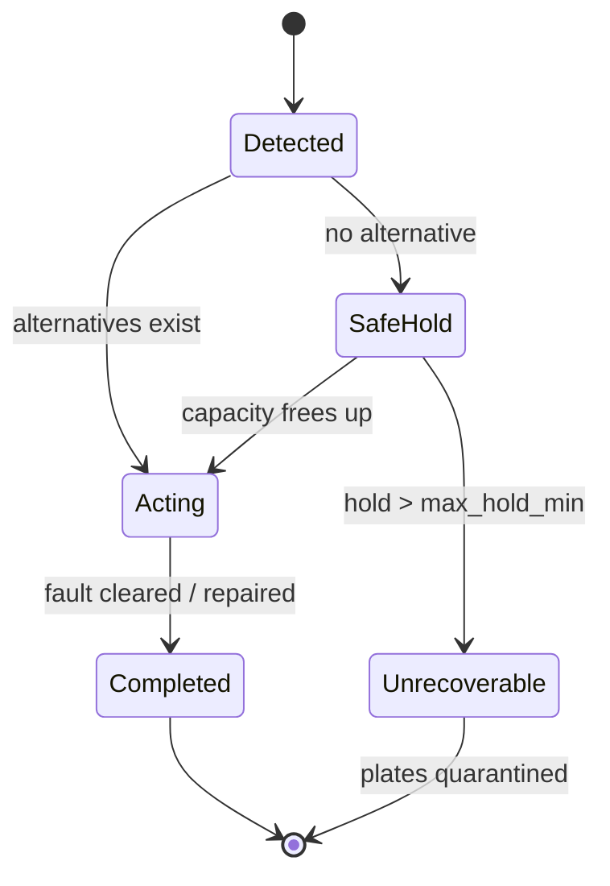

# BioFlow-X engineering report

*A fault-tolerant digital twin and supervisory control platform for a simulated cell-culture laboratory.*

Detailed design notes live in the topic documents; this report ties them together:
[architecture](architecture.md) · [simulation](simulation.md) · [scheduling](scheduling.md) ·
[faults and recovery](fault-recovery.md) · [API](api.md) · [benchmarking](benchmarking.md) ·
[anomaly detection](anomaly_detection.md) · [performance](performance.md).

---

## 1. Problem statement

An automated cell-culture lab runs many experiments at once on shared equipment: robots move
plates between incubators, media-exchange stations, imaging stations and storage. Each experiment is a
protocol of timed steps with dependencies and a deadline. The control software has to decide what to
run next, move plates without robot collisions, and keep going when equipment fails, often while
plates are in the middle of a step.

BioFlow-X builds that control software and a simulated lab to run it against. The goal is to design,
test and measure scheduling, coordination and fault tolerance without hardware.

## 2. Motivation

- **Workflow orchestration under constraints** is the core problem of lab automation, and it appears
  in manufacturing and logistics too: shared resources, precedence, deadlines, failures.
- **Testing a controller needs a plant.** A deterministic, faster-than-real-time simulation lets the
  same controller be run thousands of times, under injected faults, with ground truth to score it.
- **Honest measurement.** Scheduling claims are only meaningful with fair, repeated comparisons.
  Building the benchmark harness was as much a goal as building the schedulers.

## 3. Requirements

| Type | Requirement | How it is met |
|---|---|---|
| Functional | Protocols are data, not code | YAML protocols, validated, compiled to task graphs |
| Functional | Multiple scheduling policies, swappable | FIFO, priority, EDF, cost-based behind one interface |
| Functional | Robots move on a floor plan without collisions | A* + cell reservations; deadlock detection and resolution |
| Functional | Faults are injected, detected from symptoms and recovered from automatically | Injector/monitor/detector/recovery chain, scored against ground truth |
| Functional | Observable and controllable while running | Telemetry, SQLite, REST API, Streamlit dashboard |
| Non-functional | Deterministic and reproducible | Seeded RNG, FIFO tie-breaks, event-ordered bus |
| Non-functional | Faster than real time, scales to thousands of plates | 5,000 plates / 140 simulated days in ~1 min |
| Non-functional | Configurable without code changes | YAML configs with "did you mean" validation |
| Non-functional | Tested | 778 automated tests, 97 % line coverage, lint clean |
| Constraint | Local, Windows, Python-first, no unnecessary technology | Standard library + a small set of well-known packages |

## 4. System architecture

A layered architecture with one-way dependencies (core ← domain ← plant ← control/faults ← interfaces),
wired together in a single composition root (`Laboratory`). Components communicate through an event
bus rather than direct calls, so observers (telemetry, metrics, dashboard, detector) never need to
be known by the components they watch.

Details: [architecture.md](architecture.md).

## 5. Domain model

| Entity | Key attributes | Rules enforced in the object itself |
|---|---|---|
| `Plate` | id, experiment, cell type, state, location, history | Transition table, e.g. a plate cannot be imaged while in transit |
| `Protocol` | ordered steps, culture conditions | INCUBATE needs a duration; ARCHIVE/DISPOSE last; TRANSPORT is implicit |
| `Experiment` | protocol, plate count, priority, deadline, status | Deadline after submission; status derived from its tasks |
| `Task` | plate, step, operation, dependencies, state, timestamps | READY only after all dependencies complete |
| `Equipment` | kind, capacity, state, occupancy | Per-kind state machine; single `_set_state` choke point |

Finite states are enums; transition tables are declarative and validated when they are built. Tests
check every table against its complete list of legal moves, so every other pair is proven illegal.

## 6. Digital twin

The twin is the single, live, queryable state of the simulated lab: floor plan, equipment state and
occupancy, robot positions and planned paths, plates and their histories, tasks, reservations,
observed environment readings, and active faults. Each fact has exactly one owner (for example,
equipment owns occupancy and the resource manager owns only reservations). The API and the dashboard's
2D view are drawn only from this state. Injected ground truth is kept on a separate channel, and the
detector is tested never to read it. See [simulation.md](simulation.md).

*INCUBATOR_01 (red) has lost climate control; robots 02 and 03 are evacuating its plates to INCUBATOR_02.*

## 7. Discrete-event simulation

A priority queue of `(time, sequence)` events; the clock jumps from event to event. Ties run in
scheduling order, and all randomness comes from one seeded generator, so a run is reproducible.
Cancellation is lazy (O(1)), and the clock refuses to go backwards (which would mean a causality
violation). The event bus delivers notifications in causal FIFO order, a property that was added after
a real ordering bug was found (Phase 16).

## 8. Scheduling algorithms

A policy decides three things: the order in which to try READY tasks, which free destination, and which
idle robot. The dispatcher executes: it reserves the destination, sends a robot, starts processing and
completes the task. There is no head-of-line blocking.

- **FIFO**: by ready time.
- **Priority**: experiment priority, then FIFO.
- **EDF**: earliest deadline first.
- **Cost-based**: minimise `J = w_t·travel + w_s·switch − w_d·wait − w_i·idle − w_c·critical_ratio`;
  every decision can be explained term by term. Weights were tuned by random search with a train/test
  split.

Details: [scheduling.md](scheduling.md).

## 9. Robot path planning

- **Floor plan:** a grid with equipment footprints, access points, blocked cells, slow zones and
  parking cells, validated for overlaps and reachability.
- **A\*:** Manhattan heuristic (admissible because every cell costs at least 1). It is checked against
  Dijkstra on random maps, and static paths are cached.
- **Multi-robot coordination:**
  - A robot must hold the next cell before it moves, so collisions are impossible by construction.
  - Every new wait runs cycle detection on the wait-for graph. Deadlocks are resolved by escalation:
    replan around other robots, step aside, back off. A livelock guard stops the escalation safely if
    it keeps failing.
  - Idle robots park out of the way and are nudged when they block a route.
  - Robots queued behind a robot that has just become stationary (parked or broken down) are
    re-evaluated.

In the final demo, 3 robots made 25,000 steps with 226 deadlocks detected and resolved, and no collisions.

## 10. Fault detection

Ten fault types are injected as hidden physical effects. The detector sees only what a real
supervisory system would see:

- heartbeats;
- noisy sensor readings;
- movement and job events;
- error codes such as a failed pick.

It classifies faults from symptoms:

- silence with movement means the communication link is lost; silence without movement means the robot
  has failed;
- drive-time ratios reveal a slow drive;
- processing overruns reveal a hung station;
- debounced out-of-tolerance readings reveal excursions, and both out at once means climate control is
  lost;
- NaN, impossible or frozen readings reveal a sensor failure;
- repeated pick failures reveal a gripper problem.

Consequential alarms (robots delayed by a robot that is already diagnosed) are suppressed. Detections
are scored against ground truth for latency, classification and false positives. An optional
IsolationForest model catches subtle degradations below the rule thresholds (17 of 18 test cases).
Details: [fault-recovery.md](fault-recovery.md), [anomaly_detection.md](anomaly_detection.md).

## 11. Recovery architecture

The recovery manager reacts to `FAULT_DETECTED`. Each fault kind has its own policy:

- **Incubator:** evacuate, keeping the remaining incubation time, and mark exposed plates SUSPECTED.
- **Station:** abort the hung run and redo it elsewhere.
- **Robot:** hand the job to another robot, or hold a carried plate until the repair.
- **Degraded unit:** take it out of service.

Recovery only *re-queues* work. The normal scheduler picks the alternative equipment, so recovery
never bypasses the policy. With no alternative, the system enters a **safe hold**. If the hold outlasts
`max_hold_min`, the fault is declared **unrecoverable**, the stranded plates are quarantined and the
run ends cleanly instead of hanging. Recoveries are tracked from start to completion.

## 12. Event-driven architecture

- **Two event kinds:** *scheduled* events (future, in the engine queue) and *notifications*
  (immediate, on the bus).
- **Delivery:**
  - Delivery is causal FIFO: events published during delivery are queued, never nested.
  - Subscribers can filter by type or source.
  - Observer subscriptions are non-critical: an exception in telemetry is isolated and counted and
    cannot break control.
  - Per-type statistics are kept.
- **Consequence:** the dispatcher, resource manager, detector, recovery, metrics, telemetry and
  dashboard are all independent subscribers. Adding the anomaly-detection feature extractor needed no
  change to any existing component.

## 13. Database

SQLite through a thin repository (`database/`): the only module that contains SQL. A run is saved with
its configuration, summary, experiments, plates, tasks, equipment, recorded events, injected faults,
detections and recoveries, in a normalised schema
with foreign keys. Reads return plain dataclasses. Connections are opened and closed explicitly, and the
schema is created idempotently.

## 14. REST API

FastAPI with 17 endpoints (status, load/start/stop/step, experiments, plates, equipment, robots,
faults, fault injection, metrics, events). Routes only adapt HTTP to `SimulationService`, which runs one
live lab in a background thread and serialises reads with a lock. Platform errors map to 404/409/422/400
with a structured body. Details: [api.md](api.md).

## 15. Dashboard

Streamlit, reading the same `SimulationService`. It has eight pages:

- overview;
- the 2D digital twin (matplotlib, drawn from live state);
- experiments;
- equipment;
- robots;
- the scheduler's ready queue with the cost policy's explanation of each decision;
- faults (detections, recoveries and ground truth, labelled separately);
- analytics (time series).

It is tested headlessly with Streamlit's `AppTest`.

## 16. Benchmark methodology

- **Workloads:** four workload recipes (light, moderate, tight deadlines with failures, overload),
  each × 4 schedulers × 5 seeds. A seeded generator makes each seed a genuinely different scenario.
- **Paired comparisons:** every scheduler sees identical scenarios. Results are reported as mean ±
  standard deviation and as wins/ties/losses against FIFO per seed.
- **Integrity first:** completion, stalls, missed and false alarms are checked before any result is
  interpreted.
- **Weight tuning:** the cost policy's weights are chosen on training seeds and judged on held-out
  seeds.

## 17. Results

| Question | Result |
|---|---|
| Does everything finish? | 80/80 benchmark runs: 50,216/50,216 tasks completed, 0 stalls |
| Are faults caught? | 176/180 injected faults detected, 0 false alarms. The 4 misses are one imager fault with no observable effect |
| Do smarter policies help? | Under tight deadlines with failures: late experiments 71 % (FIFO) → 52-53 %, mean wait 68 → 42-44 min. Under light load: no difference |
| Is one policy best? | No. Under overload EDF minimises lateness but is late on everything (the domino effect); priority gets the most experiments in on time |
| Did tuning generalise? | Held-out objective 0.641 (FIFO) → 0.422 (hand weights) → 0.333 (tuned) |
| Does it scale? | Linear: 5,000 plates, 2.2 M events, 140 simulated days in 59 s |
| Final demo (72 plates, robot + incubator failure) | Both faults detected in 3 and 9 min, correctly classified, recovered; 408/408 tasks. The cost policy exposed 39 plates to the incubator failure vs 71 for FIFO, because first-free placement concentrates plates in one incubator |

Sources: [benchmark report](../results/reports/benchmark_report.md),
[tuning report](../results/reports/tuning_report.md), [scale report](../results/reports/scale_report.md),
[final demo](../results/reports/final_demo.md).

## 18. Limitations

- **It is a simulation.** The equipment models are simple timing and state models. There is no
  physics, no real device protocol (SiLA, OPC UA) and no hardware. The biology is abstract
  constraints only; nothing models cell growth or viability.
- **Synthetic workloads, small samples.** Results describe this simulated lab; 5 seeds per benchmark
  cell.
- **The fault models are idealised.** For example, the simulated drive has no noise, which makes slow
  drives easier to detect than on real hardware. Detection thresholds were set by hand.
- **Greedy, online scheduling.** Policies are dispatch rules, not optimal planners: no look-ahead, no
  MILP/CP optimisation.
- **Grid-based motion.** Robots occupy one cell and move in unit steps; there is no continuous
  kinematics.
- **Single-process, single-user.** The API/dashboard run one simulation at a time; there is no
  authentication, and it is not intended for deployment.

## 19. Future improvements

- A look-ahead or constraint-programming scheduler (e.g. OR-Tools CP-SAT) as a baseline for how far the
  dispatch rules are from optimal.
- Learned detection thresholds and noise in the drive and sensor models, to make detection harder and
  more realistic.
- A device-abstraction layer shaped like SiLA 2 / OPC UA, so a real instrument driver could replace a
  simulated one.
- Parallel benchmark execution across CPU cores.
- Plate-level quality tracking (e.g. exposure time outside conditions) feeding into quarantine
  decisions.
