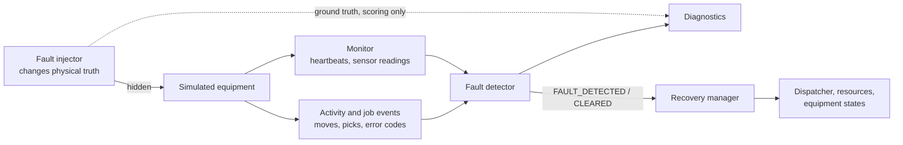

# Faults: injection, detection and recovery

The fault system is built around one rule: **what goes wrong physically is hidden; the control system
only sees symptoms**. That separation is what makes detection mean something.

## Injection (`faults/fault_injector.py`)

Ten fault types, each with a physical effect and an undo when it is repaired:

| Fault | Physical effect |
|---|---|
| ROBOT_FAILURE | Controller down: the robot freezes mid-move or mid-pick; its phase resumes exactly after repair |
| ROBOT_TIMEOUT | Degraded drive: travel is slower by a factor |
| PLATE_DETECTION_FAILURE | Gripper sensor: picks report "plate not detected" and are retried |
| INCUBATOR_FAILURE | Heater and gas supply fail: the chamber decays exponentially towards room conditions |
| TEMPERATURE_EXCURSION / CO2_EXCURSION | The chamber is held away from its setpoint |
| SENSOR_FAILURE | Stuck (repeats the last value) or dropout (no value); the chamber itself is fine |
| MEDIA_STATION_FAILURE / IMAGING_FAILURE | The current run hangs and never finishes |
| COMMUNICATION_TIMEOUT | Heartbeats stop arriving; the hardware keeps working |

Faults come from scenario files, the API, or the workload generator. They are validated (right kind of
target, no overlapping faults of the same type on one unit). A repair publishes an observable
`MAINTENANCE_COMPLETED`; ground truth goes to a separate channel.

## Detection (`faults/fault_detector.py`)

| Symptom | Diagnosis |
|---|---|
| No heartbeat for 3 min, but the robot kept moving | COMMUNICATION_TIMEOUT |
| No heartbeat, no movement, while it has a job | ROBOT_FAILURE |
| Every recent step slower than 2x its nominal drive time | ROBOT_TIMEOUT (slow drive) |
| Transport far past its expected time, *and* the robot has not moved for 10 min | ROBOT_TIMEOUT (stuck) |
| Processing past 1.5x its duration + 5 min | MEDIA_STATION_FAILURE / IMAGING_FAILURE |
| Temperature or CO2 out of tolerance on 2 consecutive readings | TEMPERATURE / CO2_EXCURSION |
| Both out at once | INCUBATOR_FAILURE (climate control lost) |
| NaN, physically impossible, or 3 identical noisy readings | SENSOR_FAILURE |
| 3 failed pick attempts | PLATE_DETECTION_FAILURE |

Detections clear from symptoms (heartbeats resume, readings return to normal, a pick succeeds) or on
maintenance sign-off when a symptom cannot resolve itself.

**Consequential alarms are suppressed.** A robot delayed behind a robot that has an active diagnosis is
not blamed itself, and the explained time is excluded from its timers. This comes from industrial alarm
management, and the Phase 24 benchmark showed it was needed.

Rules found and fixed by running at scale: matching job timers by plate (nested events), counting
activity only after the first missed heartbeat, and measuring pure drive time rather than intervals
between steps (a robot following a slow robot is not itself slow).

## Recovery (`faults/recovery.py`)

| Diagnosis | Policy |
|---|---|
| Incubator environment or sensor | ENVIRONMENTAL_FAULT; interrupt incubations (keeping the remaining time); exposed plates -> SUSPECTED; re-queue so the scheduler evacuates them |
| Station failure | FAULT; abort the hung run; redo it elsewhere |
| Robot failure | FAULT; not carrying -> hand the job to another robot; carrying -> hold and resume after repair |
| Slow drive, gripper, lost link | Out of service (no new work); gripper -> hand the pick to another robot; back on maintenance or when heartbeats return |

If there is no alternative equipment, recovery enters a **safe hold** and records the reason. If the hold
lasts longer than `max_hold_min`, the fault is declared **unrecoverable**: stranded plates are quarantined
and their work is cancelled, so the run ends cleanly instead of hanging. The supervisory FAULT state
overlays the robot's physical phase, so even a misdiagnosed robot that keeps moving cannot corrupt its
state machine.

## Results

- **Scenario `multiple_failures`** (one fault of each type): 156/156 tasks completed, all 10 faults
  detected and correctly classified, 0 false positives, and all 10 recoveries completed.
- **Benchmarks C and D** (80 runs, random faults): every task completed, 0 false alarms, 176 of 180
  faults detected. The 4 misses were one fault, seen by all four schedulers, on an imager that was
  never used while it was failed: a fault with no observable effect.
- **Optional anomaly model** ([anomaly_detection.md](anomaly_detection.md)): caught 17 of 18 subtle
  degradations below the rule thresholds.
